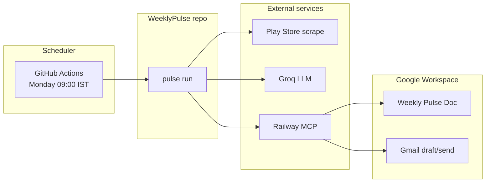

# Weekly Product Review Pulse — Deployment Plan

This document is the operator guide for taking WeeklyPulse from **code complete** to **live weekly delivery** for Groww stakeholders. It implements the delivery expectations in [problemstatement.md](./problemstatement.md) and the rollout phases in [implementation-plan.md](./implementation-plan.md).

**Repository:** [github.com/Sahithi191127/WeeklyPulse](https://github.com/Sahithi191127/WeeklyPulse)

---

## 1. What “deployment” means

WeeklyPulse is **not** a web app. There is no frontend to host. Deployment means:

| Component | Where it runs | Deploy action |
|-----------|---------------|---------------|
| **Pulse agent** (Python CLI) | GitHub Actions (recommended) or a cron host | Configure secrets + enable scheduler |
| **Hosted Google Workspace MCP** | Railway ([MCPServer](https://github.com/Sahithi191127/MCPServer)) | Already deployed — verify OAuth + `REQUIRE_APPROVAL=false` |
| **Google Doc** | Google Workspace | Create *Weekly Review Pulse — Groww*; record Doc ID |
| **Groq API** | External SaaS | API key in GitHub Secrets |
| **Run ledger / cache** | Ephemeral on runner (`data/`) | Artifacts uploaded per workflow run |



**v1 success** (problem statement): one idempotent weekly run produces a Doc section + stakeholder email (draft or send), fully auditable in the run ledger.

---

## 2. Current status

| Area | Status |
|------|--------|
| Code (Phases 0–9) | Complete — 100+ tests pass in CI |
| GitHub repo | Pushed to `main` |
| Hosted MCP | Healthy at `https://web-production-c5ea8.up.railway.app` |
| Staging E2E (real Doc + draft) | **Passed locally** (2026-W24 — verify Doc + Gmail draft manually) |
| Stakeholder sign-off | **Pending** ([sign-off-checklist.md](./sign-off-checklist.md)) |
| Production scheduler | Workflow exists — **secrets + first run pending** |
| Production email send | **Draft only** until MCPServer adds `POST /send_email` |

---

## 3. Environments

Aligned with [implementation-plan.md](./implementation-plan.md) §Environment Rollout and problem statement §Delivery Expectations.

| Environment | `PULSE_ENV` | Email mode | Doc | Purpose |
|-------------|-------------|------------|-----|---------|
| **Local** | `local` (default) | dry-run / none | optional test Doc | Dev, debugging |
| **Staging** | `staging` | `draft` | shared staging Doc | E2E validation before prod |
| **Production** | `production` | `draft` now → `send` later | production Doc | Weekly stakeholder delivery |

Staging remains **draft-only** until sign-off; production send requires MCPServer `/send_email` or manual draft send.

---

## 4. Prerequisites checklist

Complete before first staging run.

### 4.1 Google Workspace (MCP owner — Railway)

| # | Item | Owner | Verify |
|---|------|-------|--------|
| 1 | Google Cloud project with Docs + Gmail OAuth | Eng / MCP | MCPServer README |
| 2 | `GOOGLE_CREDENTIALS_JSON` + `GOOGLE_TOKEN_JSON` on Railway | Eng / MCP | `GET /health` → `has_google_token: true` |
| 3 | `REQUIRE_APPROVAL=false` on Railway | Eng / MCP | Automated append/draft not blocked |
| 4 | Optional `API_KEY` on Railway | Eng / MCP | Matches `MCP_API_KEY` in pulse secrets |

```bash
pulse mcp health
```

### 4.2 Google Doc (Ops / Product)

| # | Item | Notes |
|---|------|-------|
| 1 | Create Doc: *Weekly Review Pulse — Groww* | Shared with stakeholders |
| 2 | Record Doc ID from URL | `docs.google.com/document/d/{DOC_ID}/edit` |
| 3 | Staging vs production | Use separate Doc IDs per environment |

### 4.3 Pulse agent secrets

| Secret | Required | Where |
|--------|----------|-------|
| `GROQ_API_KEY` | Yes | GitHub **Repository secrets** |
| `GOOGLE_DOC_ID` | Yes | GitHub Repository secrets |
| `PULSE_EMAIL_TO` | Yes | Comma-separated stakeholder emails |
| `MCP_API_KEY` | If Railway uses `API_KEY` | GitHub Repository secrets |

**Use Repository secrets** (not Environment secrets) — workflows reference `${{ secrets.* }}` without an `environment:` block. See [runbook.md](./runbook.md).

Local dev: copy `.env.example` → `.env` (never commit `.env`).

### 4.4 Product config

| # | Item | Location |
|---|------|----------|
| 1 | Play Store app id `com.nextbillion.groww` | `config/products/groww.yaml` |
| 2 | Recipients (fallback if no `PULSE_EMAIL_TO`) | `groww.yaml` or `groww.production.yaml.example` |
| 3 | Pipeline limits (Groq 12K/run, 5 themes) | `config/pipeline.yaml` |

### 4.5 Stakeholders (Product)

| Audience | Needs |
|----------|-------|
| Product | Access to pulse Google Doc |
| Support | Same |
| Leadership | Same + email teaser (draft or send) |

---

## 5. Deployment phases

### Phase A — Local verification (Day 1)

**Goal:** Confirm agent works on your machine before touching production Doc.

```powershell
cd WeeklyPulse
.venv\Scripts\activate
pip install -e ".[dev]"

pulse config validate --secrets
pulse mcp health
pulse ingest --product groww
pulse dry-run --product groww
pytest -q -m "not staging"
```

**Exit:** dry-run completes; tests pass; no Google writes.

---

### Phase B — Staging E2E (Day 1–2)

**Goal:** One real weekly run to staging Doc + Gmail draft. Satisfies problem statement delivery path and implementation plan Phase 8.

**Use a staging Doc ID** (not production) via env or a test `GOOGLE_DOC_ID` secret.

```powershell
$env:PULSE_EMAIL_MODE = "draft"
pulse run --product groww --iso-week 2026-W24 --email-mode draft
pulse status --product groww --iso-week 2026-W24
pulse quality-gate --product groww --iso-week 2026-W24
pulse run --product groww --iso-week 2026-W24   # must skip (idempotent)
```

**Manual checks** ([staging-e2e.md](./staging-e2e.md)):

| # | Check |
|---|-------|
| 1 | Doc section heading: `Groww — Weekly Review Pulse — 2026-W24` |
| 2 | Sections present: Top themes, Real user quotes, Action ideas, Who this helps |
| 3 | Gmail draft: 3–5 theme bullets + Doc link |
| 4 | No raw PII (emails/phones) in Doc or email body |
| 5 | Re-run same week = no duplicate section or draft |
| 6 | `pulse status` shows doc + email delivery IDs |

**Exit:** [sign-off-checklist.md](./sign-off-checklist.md) completed by Product / Support / Leadership.

---

### Phase C — GitHub Actions setup (Day 2)

**Goal:** Enable automated weekly runs from [WeeklyPulse](https://github.com/Sahithi191127/WeeklyPulse).

#### C.1 Repository secrets

Settings → Secrets and variables → Actions → **Repository secrets**:

| Name | Value |
|------|-------|
| `GROQ_API_KEY` | From Groq console |
| `GOOGLE_DOC_ID` | Production (or staging for first test) Doc ID |
| `PULSE_EMAIL_TO` | `lead1@example.com,lead2@example.com` |
| `MCP_API_KEY` | Railway API key (if configured) |

#### C.2 Verify CI

Push to `main` → Actions → **CI** workflow should pass.

#### C.3 Manual workflow test

Actions → **Weekly Pulse (Production)** → **Run workflow**

Optional: set `iso_week` input (e.g. `2026-W24`).

Workflow steps:

1. `pulse config production-check`
2. `pulse run --product groww`
3. `pulse quality-gate`
4. Upload `data/runs/` artifacts

**Exit:** workflow green; Doc updated; Gmail draft created; artifact uploaded.

---

### Phase D — Production cutover (Week 1)

**Goal:** First scheduled Monday 09:00 IST run without manual intervention.

#### D.1 Pre-cutover (Friday before go-live)

```bash
PULSE_ENV=production PULSE_EMAIL_MODE=draft pulse config production-check --product groww
```

Confirm:

- [ ] Production `GOOGLE_DOC_ID` in secrets
- [ ] Stakeholder emails in `PULSE_EMAIL_TO`
- [ ] MCP health OK
- [ ] Sign-off checklist signed

#### D.2 Go-live

- [ ] Enable schedule: `.github/workflows/weekly-pulse.yml` (`cron: "30 3 * * 1"` = Monday 09:00 IST)
- [ ] Monitor first scheduled run in Actions
- [ ] Verify `pulse status` equivalent via workflow logs + artifacts
- [ ] Confirm stakeholders received Gmail **draft** (send manually from Gmail until `/send_email` exists)

#### D.3 Week 2 validation (Phase 9 exit)

- [ ] Second consecutive Monday run succeeds without manual fix
- [ ] Ledger shows `completed` for both ISO weeks (in workflow artifacts / manual `pulse status` if run locally against same week)
- [ ] Share [runbook.md](./runbook.md) with on-call owner

---

### Phase E — Enable production send (when ready)

**Blocked today:** MCPServer v1 has `POST /create_email_draft` only.

When MCPServer adds `POST /send_email`:

1. Deploy endpoint on Railway
2. `pulse mcp health` lists `/send_email`
3. `pulse config production-check` passes send check
4. Manual test: `pulse run --product groww --email-mode send`
5. Update workflow: `PULSE_EMAIL_MODE: send`
6. Monitor one Monday run; confirm inbox delivery (not draft)

---

## 6. What gets deployed where

| Artifact | Deploy target | Notes |
|----------|---------------|-------|
| `WeeklyPulse` repo | GitHub `main` | Already pushed |
| CI workflow | GitHub Actions | Runs on every push/PR |
| Weekly scheduler | GitHub Actions | Monday 09:00 IST |
| MCPServer | Railway | Separate repo; OAuth lives here |
| Secrets | GitHub Repository secrets | Never in git |
| `groww.yaml` | In repo | Prefer secrets for Doc ID + emails in prod |
| BGE embedding model | Downloaded on first run | Hugging Face; ~90s cold start on Actions |

**Do not deploy:**

- `.env` (gitignored)
- `data/cache/`, `data/ledger.sqlite` (ephemeral per run on Actions)
- In-repo `mcp-servers/` stubs (superseded by hosted MCP)

---

## 7. Rollout gates (go / no-go)

| Gate | Criteria | Owner |
|------|----------|-------|
| **G1 — Code** | CI green on `main` | Eng |
| **G2 — MCP** | `pulse mcp health` OK; token valid | Eng / MCP |
| **G3 — Staging E2E** | One full `pulse run` + idempotency + quality gate | Eng |
| **G4 — Sign-off** | [sign-off-checklist.md](./sign-off-checklist.md) approved | Product |
| **G5 — Secrets** | All repository secrets set | Eng |
| **G6 — First workflow** | Manual `workflow_dispatch` succeeds | Eng |
| **G7 — Production** | Two consecutive Monday runs succeed | Eng + on-call |

Do not enable production schedule until **G1–G6** pass.

---

## 8. Monitoring and audit

### Per-run verification

```bash
pulse status --product groww --iso-week YYYY-Www --json
pulse quality-gate --product groww --iso-week YYYY-Www --json
```

### Metrics to review (problem statement: auditable runs)

| Metric | Source |
|--------|--------|
| Review count (raw + normalized) | `pulse_report.json` artifact / quality-gate |
| Theme count, noise % | `stats` in report |
| Groq requests / tokens | `stats.groq_*` |
| Stage durations | JSON logs `event=pulse_run_stage` |
| Doc anchor + URL | `pulse status` → `doc_delivery` |
| Email idempotency key + draft/message id | `pulse status` → `email_delivery` |

### Alerts (recommended)

- GitHub Actions failure notification on **Weekly Pulse (Production)**
- Optional: Slack/email on workflow failure

---

## 9. Failure recovery (summary)

Full detail: [runbook.md](./runbook.md).

| Scenario | Action |
|----------|--------|
| Full run failed | `pulse run --product groww --iso-week YYYY-Www` |
| Doc ok, Gmail failed | Re-run same week — Gmail only retried |
| MCP 403 | Set `REQUIRE_APPROVAL=false` on Railway |
| Groq 429 | Wait; retry; check daily quota |
| Duplicate concern | Re-run same week — should skip |

---

## 10. v1 definition of done

From [implementation-plan.md](./implementation-plan.md) — check off when **live**, not just coded:

| Requirement (problem statement) | Verification |
|----------------------------------|--------------|
| Groww Play reviews ingested weekly (8–12 week window) | `pulse ingest` + cache manifest |
| Clustered report in Google Doc via MCP | Staging/prod Doc section visible |
| Stakeholder email with Doc deep link | Gmail draft (or send) |
| Idempotent re-runs | Second `pulse run` skips |
| Auditable history | `pulse status` + ledger |
| PII scrubbed; token limits | quality-gate + pipeline config |
| Weekly scheduler operational | Two Mondays green in Actions |

---

## 11. Recommended timeline

| Day | Activity |
|-----|----------|
| 1 | Phase A (local) + Phase B (staging E2E) |
| 2 | Sign-off + Phase C (GitHub secrets + manual workflow) |
| 3–7 | Buffer for fixes; optional backfill test |
| Next Monday | Phase D go-live (scheduled run) |
| Monday +1 | Phase D validation (second consecutive success) |
| TBD | Phase E (enable send when MCPServer ready) |

---

## 12. Related documents

| Document | Purpose |
|----------|---------|
| [problemstatement.md](./problemstatement.md) | Product intent, requirements, non-goals |
| [implementation-plan.md](./implementation-plan.md) | Phase-wise build history |
| [staging-e2e.md](./staging-e2e.md) | Staging runbook |
| [runbook.md](./runbook.md) | Production operations |
| [sign-off-checklist.md](./sign-off-checklist.md) | Stakeholder approval |
| [mcp-api.md](./mcp-api.md) | Hosted MCP REST contract |
| [.env.production.example](../.env.production.example) | Scheduler env template |

---

## 13. Quick start (your next 3 commands)

If repo is cloned and `.env` has `GROQ_API_KEY`:

```powershell
pulse config validate --secrets
pulse run --product groww --iso-week 2026-W24 --email-mode draft
pulse quality-gate --product groww --iso-week 2026-W24
```

Then add GitHub Repository secrets and trigger **Weekly Pulse (Production)** manually.
