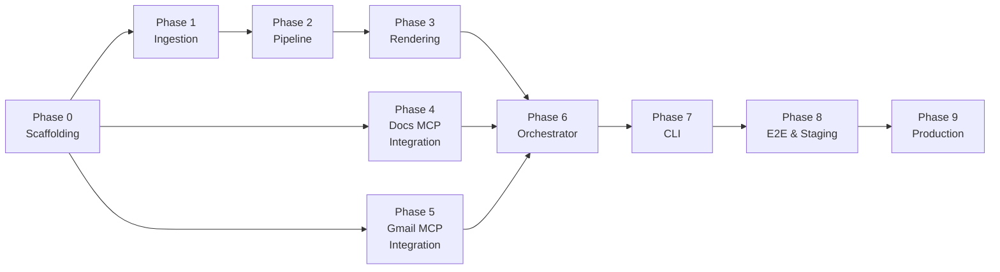

# Weekly Product Review Pulse — Implementation Plan

This document is the phase-wise build plan for the Groww Play Store weekly pulse. It implements the requirements in [problemstatement.md](./problemstatement.md) and the technical design in [Architecture.md](./Architecture.md).

---

## Summary

| Item | Value |
|------|-------|
| **Product** | Groww |
| **Review source** | Google Play Store only |
| **Delivery** | Hosted Google Workspace MCP on Railway (`https://web-production-c5ea8.up.railway.app`) |
| **Cadence** | Weekly (Monday 09:00 IST target) + ISO-week backfill CLI |
| **v1 success** | One idempotent weekly run produces a Doc section + draft/send email, fully auditable in the run ledger |
| **Phase status** | Phase 0 ✅ · Phase 1 ✅ · Phase 2 ✅ · Phase 3 ✅ · Phase 4 ✅ · Phase 5 ✅ · Phase 6 ✅ · Phase 7 ✅ · Phase 8 ✅ · Phase 9 ✅ (code; live send pending MCPServer) |

---

## Research & Validated Assumptions (Groww, Jun 2026)

Findings from live ingestion and data analysis that inform Phase 2+.

### Ingestion cache (Phase 1 — validated)

| Item | Value |
|------|-------|
| **Cache path** | `data/cache/groww/{YYYY-MM-DD}/` |
| **Files** | `reviews.json` (all scraped), `reviews_normalized.json` (filtered), `manifest.json` |
| **Review fields** | `{ text, rating }` only — no `review_id` or `published_at` on disk |
| **CLI** | `pulse ingest --product groww [--force-refresh]` |

**Latest live pull** (`2026-06-12`, 10-week window):

| Metric | Value |
|--------|-------|
| Raw reviews (`reviews.json`) | 4,371 |
| Normalized reviews | 1,266 (~29%) |
| Window | 2026-04-03 → 2026-06-12 |
| 1–2★ share (normalized) | ~50% |
| Median review length | 18 words / 101 chars |
| Max review length | 104 words / 500 chars |

**Normalization drops** (see `manifest.json` → `normalization`):

| Reason | Typical count |
|--------|---------------|
| &lt; 8 words | ~2,800 |
| Emoji | ~170 |
| Non-English | ~140 |

**Recurring themes in normalized text:** brokerage/charges, trading, options, charts, customer support, app updates.

### Phase 2 pipeline — design validation

Analysis confirms the planned approach (scrub → BGE-small embed → UMAP → HDBSCAN → rank by `size × (6 − avg_rating)` → Groq per cluster) is **appropriate** for this dataset.

| Decision | Status | Notes |
|----------|--------|-------|
| PII scrub before embed/LLM | ✅ Required | Reviews contain names, amounts, order details |
| `BAAI/bge-small-en-v1.5` | ✅ Suitable | Short–medium reviews; semantic clustering; runs locally, no API key |
| UMAP + HDBSCAN (`min_cluster_size=5`) | ✅ Suitable | 1,266 points is sufficient |
| Complaint ranking formula | ✅ Suitable | ~50% 1–2★; deprioritizes generic 5★ praise |
| `max_review_chars: 2000` | ✅ Safe | No normalized review exceeds 500 chars today |

**Implement in Phase 2 (required, not optional):**

1. **Clustering fallbacks** — probe runs show ~50% HDBSCAN noise on keyword proxy; real embeddings will improve this but fallbacks from [edge-cases.md](./edge-cases.md) §3 must be implemented (lower `min_cluster_size`, rating-stratified pass, dominant-cluster split).
2. **Rating-aware clustering** — when one cluster &gt; 80% of reviews, split by 1–2★ vs 4–5★ before re-rank; optionally prefix `"Rating: N."` in embed input for clearer theme separation.
3. **Use latest cache** — pipeline reads `reviews_normalized.json` from most recent complete cache (e.g. `2026-06-12`), not legacy `reviews_raw.json` folders.

**Known data noise (acceptable v1):** broken English still passes langdetect (`wrost`, `cant able to`); generic short praise may form low-value clusters (ranking formula mitigates).

### Groq LLM limits (Developer plan — confirmed in console)

Model: **`llama-3.3-70b-versatile`** (summarization only; embeddings use local BGE-small).

| Limit | Groq console | Pipeline config |
|-------|--------------|-----------------|
| Requests / minute | **30** | `request_interval_seconds: 2` (sequential, no parallel) |
| Requests / day | **1,000** | ~5–10 per weekly run |
| Tokens / minute | **12,000** | Keep each request &lt; ~10K tokens |
| Tokens / day | **100,000** | `max_tokens_per_run: 12,000` |

**Per weekly Groww run (estimated):**

| Metric | Typical | % of daily cap |
|--------|---------|----------------|
| Groq requests | 5–10 | ~1% of RPD |
| Groq tokens | 6–8K | ~6–8% of TPD |

**TPM (12K) is the tightest constraint** — never parallelize Groq calls. Retry 429/529 with exponential backoff (max 3).

**BGE-small (embeddings):** `BAAI/bge-small-en-v1.5` via `sentence-transformers`, batch 64 — runs locally; first run downloads model from Hugging Face. Optional: `embedding.provider: openai` + `OPENAI_API_KEY`.

### Hosted Google Workspace MCP (Phases 4–5)

| Item | Value |
|------|-------|
| **Source repo** | [github.com/Sahithi191127/MCPServer](https://github.com/Sahithi191127/MCPServer) |
| **Endpoint** | `https://web-production-c5ea8.up.railway.app` |
| **Deployment** | Railway (FastAPI — `POST /append_to_doc`, `POST /create_email_draft`, `GET /health`) |
| **Pulse agent role** | HTTP client; passes `DocSection.content` and `EmailTeaser` payloads |
| **OAuth** | `GOOGLE_CREDENTIALS_JSON` / `GOOGLE_TOKEN_JSON` on Railway — not in WeeklyPulse |
| **Automation** | Railway must set `REQUIRE_APPROVAL=false`; optional `API_KEY` ↔ client `MCP_API_KEY` |
| **In-repo `mcp-servers/`** | Legacy stubs only; superseded for delivery |

---

## Prerequisites

Before Phase 1, confirm the following:

| Prerequisite | Owner | Notes |
|--------------|-------|-------|
| Groww Play Store package id | Eng | Verify `com.nextbillion.groww` (or current listing) in `config/products/groww.yaml` |
| Google Doc for pulse | Ops / Product | Create *Weekly Review Pulse — Groww*; record `google_doc_id` |
| Google Cloud project + OAuth | Eng / MCP owner | Docs + Gmail scopes configured on **Railway MCP server** (`web-production-c5ea8.up.railway.app`) |
| Hosted MCP server | Eng | `https://web-production-c5ea8.up.railway.app` deployed and reachable; Docs + Gmail tools exposed |
| API keys | Eng | `GROQ_API_KEY` (summarization); `MCP_API_KEY` if required by hosted MCP. Embeddings: local BGE-small (no key) |
| Stakeholder email list | Product | Recipients in `groww.yaml`; staging uses draft-only |
| Python 3.11+ | Eng | Pulse agent in Python; MCP client connects to Railway over HTTPS (Architecture §9.3) |

---

## Phase Overview

Phases 4 and 5 integrate with the **same hosted MCP server** on Railway and can run **in parallel** after Phase 3. Phase 6 requires Phases 2, 3, 4, and 5. In-repo `mcp-servers/` stubs are not used for delivery.

---

## Phase 0 — Repository Scaffolding ✅

**Goal:** Runnable project skeleton, config contracts, and dev ergonomics—no business logic yet.

### Tasks

- [x] Create directory layout per Architecture §4 (`pulse/`, `mcp-servers/`, `config/`, `tests/`, `data/`).
- [x] Add `pyproject.toml` / `requirements.txt` for pulse (CLI, pydantic, httpx, sklearn, umap-learn, hdbscan, sentence-transformers, groq, sqlite; openai optional extra).
- [x] Add `package.json` workspaces or separate packages for `google-docs-mcp` and `gmail-mcp`.
- [x] Add `config/products/groww.yaml` and `config/pipeline.yaml` with documented keys (Architecture §11).
- [x] Add `config/mcp/docs-mcp.env.example` and `gmail-mcp.env.example`; gitignore real `.env` files.
- [x] Add `config/mcp/servers.json` MCP host config (Architecture §9.3).
- [x] Add `.gitignore` for `data/`, env files, `__pycache__`, `node_modules`, `.env`.
- [x] Add minimal `README` with setup steps (install, env vars, how to run tests).

### Exit criteria

- [x] `pulse --help` exits 0 (stub CLI).
- [x] Config files load without error; missing secrets fail with clear messages.
- [x] Local `mcp-servers/` stubs build/start in stdio mode (superseded by hosted Railway MCP for Phases 4–5).

---

## Phase 1 — Play Store Ingestion ✅

**Goal:** Fetch, normalize, cache, and expose Groww reviews for the analysis pipeline.

**References:** Architecture §6.

### Tasks

- [x] Implement `pulse/ingestion/models.py` — `RawReview`, `Review`, `RunContext` (`text`, `rating` only on disk).
- [x] Implement `pulse/ingestion/play_store.py` — scrape public reviews, paginate, filter by date window (8–12 weeks); `published_at` used at scrape time only.
- [x] Implement `pulse/ingestion/normalizer.py` — drop &lt; 8 words, emoji, non-English; dedupe by `(text, rating)`.
- [x] Implement `pulse/ingestion/cache.py` — write `reviews.json`, `reviews_normalized.json`, `manifest.json` under `data/cache/{product}/{date}/`.
- [x] Rate limiting + exponential backoff on scrape errors.
- [x] Define `ReviewSource` protocol for future sources (App Store out of v1 scope).
- [x] `pulse ingest` CLI with `--force-refresh`.
- [x] Unit tests with fixture JSON snapshots (no live scrape in CI).

### Exit criteria

- [x] Manual run fetches ≥20 normalized reviews for Groww (live: **1,266** normalized from **4,371** raw, 10-week window).
- [x] Cache hit on re-run same day skips re-scrape (`--force-refresh` to override).
- [x] Ingestion failure aborts before downstream pipeline; incomplete `manifest.json` on failure.
- [x] Tests pass in CI without network (25 tests).

---

## Phase 2 — Analysis Pipeline

**Goal:** Scrub → embed → cluster → summarize → validate quotes; produce a structured `PulseReport`.

**References:** Architecture §7, [edge-cases.md](./edge-cases.md) §3, **Research & Validated Assumptions** above.

**Input:** `data/cache/groww/{date}/reviews_normalized.json` (~1,266 reviews, `{ text, rating }`).

### Tasks

- [ ] Implement `pulse/pipeline/scrubber.py` — email, phone, ID-like sequences, tokenized URLs; keep financial amounts (Architecture §7.1). Required: normalized data contains names and amounts.
- [x] Implement `pulse/pipeline/embeddings.py` — BGE-small `BAAI/bge-small-en-v1.5` (default), OpenAI optional, batch size 64, cache key `sha256(scrubbed_text + rating)`.
- [ ] Implement `pulse/pipeline/clustering.py` — UMAP + HDBSCAN; rank by `size × (6 − avg_rating)`; top `max_themes` (5); **mandatory fallbacks** per edge-cases §3:
  - Lower `min_cluster_size` once if all noise
  - Rating split (1–2★ vs 4–5★) if one cluster &gt; 80%
  - Optional: prefix rating in embed input for clearer sentiment clusters
- [ ] Enforce ML floor: abort if normalized count `< min_reviews` (default 20; live data ~1,266).
- [ ] Implement `pulse/pipeline/summarizer.py` — Groq `llama-3.3-70b-versatile`, **sequential only** (Groq TPM 12K / RPM 30), `request_interval_seconds ≥ 2`, JSON schema output.
- [ ] Implement `pulse/pipeline/quote_validator.py` — substring match on scrubbed text; ellipsis prefix match; re-prompt once per cluster on total quote failure.
- [ ] Token budget enforcement: `max_tokens_per_run: 12,000` (within Groq TPD 100K); pre-flight estimate; drop longest samples first.
- [ ] `pulse dry-run` or `pulse pipeline` command: run through clustering, log noise %, cluster sizes, and token estimate before Groq.
- [ ] Table-driven tests for scrubber, validator; golden-file test for clustering on fixed embeddings; mock Groq for summarizer tests.

### Groq budget (per run)

| Cap | Config / console | Enforced how |
|-----|------------------|--------------|
| ≤ 30 RPM | Developer plan | Sequential calls, 2s interval |
| ≤ 12K TPM | Developer plan | No parallel requests; &lt;10K tokens/request |
| ≤ 12K tokens/run | `max_tokens_per_run` | Pre-flight estimate + sample truncation |
| ≤ 10 requests/run | 5 themes + re-prompts | `max_themes: 5` |

### Exit criteria

- Dry pipeline on cached Groww reviews (`reviews_normalized.json`) produces 3–5 themes with ≥1 validated quote each.
- Typical run: ≤10 Groq requests, ≤12K tokens (usually ~6–8K) — within Developer plan headroom.
- Clustering fallbacks exercised in tests; noise rate logged per run.
- Hallucinated quotes never appear in `PulseReport` output.
- Run aborts cleanly when review count &lt; 20 or clustering fallbacks exhaust.

---

## Phase 3 — Output Generation

**Goal:** Turn `PulseReport` into plain-text Doc content and email teaser payloads (no Google API calls).

**References:** Architecture §8.

### Tasks

- [x] Implement `pulse/render/doc_section.py` — plain-text section: heading, metadata, themes, quotes, actions, who this helps (MCP appends as-is; no Docs formatting).
- [x] Deterministic anchor key `{product}-{iso_week}` and heading text `Groww — Weekly Review Pulse — {iso_week}`.
- [x] Implement `pulse/render/email_teaser.py` — subject, 3–5 theme bullets, CTA placeholder for deep link, footer with window + timestamp (Architecture §8.3).
- [x] Snapshot tests: rendered `content` matches expected JSON fixtures for a sample `PulseReport`.

### Exit criteria

- `DocSection` and `EmailTeaser` serialize to stable JSON for MCP tool inputs.
- Sample output visually matches problem statement §Sample Output structure.
- No HTML/raw Google API structures leak into pulse agent—only MCP-oriented DTOs.

---

## Phase 4 — Google Docs MCP Integration (Hosted)

**Goal:** Integrate pulse delivery with **Docs tools on the hosted MCP server** — no in-repo Docs MCP implementation.

**MCP endpoint:** `https://web-production-c5ea8.up.railway.app`  
**References:** Architecture §9.1, §9.3.

### Context

Google Docs OAuth and API access are owned by the Railway deployment. This phase wires the pulse agent to call Docs tools remotely and validates the contract against staging.

### Tasks

- [x] Document tool contract with MCP owner: `find_section_by_anchor`, `append_section`, `get_document_url` (inputs/outputs per Architecture §9.1). See [mcp-api.md](./mcp-api.md) for hosted REST mapping.
- [x] Update `config/mcp/servers.json` — point `google-workspace` URL to `https://web-production-c5ea8.up.railway.app` (HTTP transport).
- [x] Add `config/mcp/mcp.env.example` — `MCP_SERVER_URL`, optional `MCP_API_KEY`; remove dependency on local `docs-mcp.env` for delivery.
- [x] Implement connectivity check in `pulse config validate --secrets` (reach hosted MCP, list Docs tools).
- [ ] Manual staging test: `append_section(document_id, anchor, content)` with `DocSection.content` from Phase 3 (plain text).
- [x] Verify idempotency: re-run same anchor returns existing URL without duplicate append (local delivery ledger; Architecture §8.2).
- [x] Verify `get_document_url` returns a shareable link for email CTA (client-built Google Docs URL).
- [x] Integration tests in pulse repo: mock HTTP MCP client for Docs tool calls (no Google credentials in CI).

### Exit criteria

- [ ] Staging Doc receives one weekly section as plain text; content matches `DocSection.content`.
- [x] Re-run same `(product, iso_week)` anchor does not duplicate the section (local ledger + `pulse deliver-doc`).
- [x] Pulse agent discovers and calls Docs append via hosted MCP (`pulse mcp health`, `pulse deliver-doc`).
- [x] No Google OAuth variables in the pulse agent process.

---

## Phase 5 — Gmail MCP Integration (Hosted)

**Goal:** Integrate pulse delivery with **Gmail tools on the same hosted MCP server** — no in-repo Gmail MCP implementation.

**MCP endpoint:** `https://web-production-c5ea8.up.railway.app`  
**References:** Architecture §9.2, §9.3.

### Context

Gmail OAuth and send/draft logic live on Railway alongside Docs tools. Pulse passes `EmailTeaser` payloads from Phase 3.

### Tasks

- [x] Document tool contract with MCP owner: `check_idempotency`, `create_draft`, `send_email` — see [mcp-api.md](./mcp-api.md) (hosted REST + local idempotency ledger).
- [x] Confirm idempotency key format `{product}-{iso_week}-email` is supported on hosted server (local ledger in WeeklyPulse).
- [x] Wire `EmailTeaser` fields → MCP tool args (`subject`, `text_body`, `idempotency_key`, recipients from `groww.yaml`).
- [ ] Manual staging: `create_draft` produces draft with teaser bullets + Doc deep link from Phase 4.
- [x] Staging idempotency: second call with same key skips duplicate draft (`pulse deliver-email`).
- [ ] Production path: `send_email` when `delivery.email.default_mode: send` — **blocked:** MCPServer v1 has no `send_email` endpoint (draft only).
- [x] Integration tests in pulse repo: mock HTTP MCP client for Gmail tool calls.

### Exit criteria

- [ ] Staging draft contains correct subject, theme bullets, and Doc link.
- [x] Idempotency key prevents duplicate email on retry (local ledger).
- [ ] `send_email` path verified before production (Phase 9) — pending MCPServer endpoint.
- [x] Pulse agent never imports Google client libraries for mail.

---

## Phase 6 — Orchestrator, MCP Client & Run Ledger

**Goal:** Wire ingestion → pipeline → render → MCP delivery with full idempotency and audit.

**References:** Architecture §5, §10, §14.

### Tasks

- [ ] Implement `pulse/ledger/models.py` — `RunRecord`, `DeliveryRecord`.
- [ ] Implement `pulse/ledger/store.py` — SQLite `runs` + `deliveries` tables; unique `(product, iso_week)` for `status = completed`.
- [ ] Implement `pulse/agent/mcp_client.py` — connect to hosted MCP at `MCP_SERVER_URL` / `servers.json`; HTTP/SSE transport; tool call wrapper with timeout + retry (max 3, exponential backoff).
- [ ] Implement `pulse/agent/orchestrator.py`:
  1. Resolve ISO week and load product/pipeline config.
  2. Idempotency check via ledger → early exit if completed.
  3. Ingest → analyze → render.
  4. `find_section_by_anchor` → `append_section` if needed.
  5. `check_idempotency` → `create_draft` or `send_email`.
  6. Record deliveries + mark run `completed`.
- [ ] Handle partial failure: Doc success + Gmail fail → ledger `failed` with partial delivery ids; retry safe (Architecture §14).
- [ ] Structured JSON logging: `run_id`, `product`, `iso_week`, stage, duration.
- [ ] Optional artifact: JSON report snapshot in `data/runs/{run_id}/`.
- [ ] Integration test: full orchestrator with mocked MCP + ledger idempotency.

### Exit criteria

- Re-running same `(groww, iso_week)` is a no-op after success (ledger + MCP anchors).
- Failed Gmail after successful Doc append retries Gmail only; Doc not duplicated.
- Audit record matches Architecture §5 run output schema.
- No Google OAuth variables required in pulse agent process.

---

## Phase 7 — CLI & Scheduling Hooks

**Goal:** Operator-facing commands for weekly run, backfill, dry-run, and status.

**References:** Architecture §12.

### Tasks

- [x] Implement `pulse/cli.py` commands:
  - `pulse run --product groww [--iso-week YYYY-Www] [--email-mode draft|send]`
  - `pulse backfill --product groww --from YYYY-Www --to YYYY-Www`
  - `pulse dry-run --product groww [--iso-week ...]` — pipeline + render; skip MCP
  - `pulse status --product groww --iso-week YYYY-Www` — ledger + delivery ids
- [x] Default ISO week policy: current week, or previous complete week on Monday IST (configurable).
- [x] Env overrides: `PULSE_EMAIL_MODE`, `GROQ_API_KEY` (OpenAI key only if `embedding.provider: openai`).
- [x] Document cron / GitHub Actions / Cloud Scheduler snippet for Monday 09:00 IST.

### Exit criteria

- `pulse dry-run --product groww` completes end-to-end without Google writes.
- `pulse backfill` processes weeks sequentially; skips completed weeks.
- `pulse status` answers “what was sent when, for which week?” from ledger.

---

## Phase 8 — Integration, Staging E2E & Quality Gate

**Goal:** Validate full system against real Google APIs in staging before production send.

**References:** Architecture §13, §17, §16.

### Tasks

- [ ] Staging Doc + draft-only email E2E: one real weekly run (manual — see [staging-e2e.md](./staging-e2e.md) or `STAGING_E2E=1 pytest -m staging`).
- [x] Verify Doc section content, heading anchor, and email deep link (`pulse quality-gate`, `tests/test_e2e_quality_gate.py`).
- [x] Verify PII scrubbing on sample reviews containing emails/phones (`tests/test_e2e_quality_gate.py::test_pii_scrubbed_before_render_output`).
- [x] Verify Groq rate-limit backoff (simulate or document manual 429 test) — `tests/test_summarizer.py::test_summarizer_retries_on_groq_429` + [staging-e2e.md](./staging-e2e.md) §429.
- [x] Load test: backfill 3 weeks idempotently (no duplicates) — `tests/test_e2e_quality_gate.py::test_backfill_three_weeks_idempotent`.
- [x] Review logs/metrics: review count, cluster count, Groq tokens, stage durations — `pulse quality-gate --json`, orchestrator JSON logs.
- [ ] Sign-off checklist with Product / Support / Leadership on sample report quality — [sign-off-checklist.md](./sign-off-checklist.md).

### Exit criteria

| Check | Pass |
|-------|------|
| Doc section matches expected structure | ✓ |
| Email teaser + link opens correct section | ✓ |
| Re-run same week = no duplicate Doc/email | ✓ |
| `pulse status` shows delivery ids | ✓ |
| CI: unit + integration tests green | ✓ |
| Stakeholder sample report approved | ✓ |

---

## Phase 9 — Production Rollout

**Goal:** Scheduled weekly production runs with send enabled and operational runbook.

### Tasks

- [x] Set production `google_doc_id` and `email.recipients` in `groww.yaml` (env overrides: `GOOGLE_DOC_ID`, `PULSE_EMAIL_TO`; see `groww.production.yaml.example`).
- [x] Set `delivery.email.default_mode: send` for production env only (`PULSE_ENV=production` → `resolve_email_mode` defaults to send; YAML stays `draft` for staging safety).
- [x] Deploy scheduler — [`.github/workflows/weekly-pulse.yml`](../.github/workflows/weekly-pulse.yml) Monday 09:00 IST.
- [x] Secrets documented — `.env.production.example`, GitHub Actions secrets in workflow.
- [x] Runbook — [runbook.md](./runbook.md) (failure alerts, manual retry, partial failure recovery).
- [ ] First production run monitored; confirm ledger `completed` + stakeholder receipt (manual ops).

### Exit criteria

- Two consecutive weekly production runs succeed without manual intervention.
- Run ledger provides audit trail for both weeks.
- Runbook documented and shared with on-call owner.

---

## Testing Matrix (by phase)

| Phase | Test type | What |
|-------|-----------|------|
| 1 | Unit | Fixture-based scrape parse, normalizer filters, cache I/O |
| 2 | Unit + golden | Scrubber, validator, clustering on fixed vectors, mock Groq |
| 3 | Snapshot | Doc blocks + email teaser JSON |
| 4–5 | Integration | Hosted MCP tool calls (mocked in CI; manual against Railway in staging) |
| 6 | Integration | Orchestrator + mock MCP + SQLite ledger |
| 8 | Manual E2E | Real staging Doc + draft email |

---

## Environment Rollout

| Environment | When | Email | Doc |
|-------------|------|-------|-----|
| Local | Phases 1–7 | — / dry-run | Test doc id optional |
| Staging | Phase 8 | `draft` | Staging shared doc |
| Production | Phase 9 | `send` | Production pulse doc |

Staging remains **draft-only** until explicit sign-off to set `default_mode: send` (problem statement §Delivery Expectations).

---

## Risks & Mitigations

| Risk | Phase | Mitigation |
|------|-------|------------|
| Play Store scrape breakage | 1 | Fixture tests; cache; user-agent + backoff |
| Low normalized review volume | 2 | `min_reviews` gate; alert on abort (live: 1,266 ✅) |
| High HDBSCAN noise (~50% in probes) | 2 | Mandatory fallbacks; rating split; log noise % |
| Groq rate limits (30 RPM / 12K TPM / 100K TPD) | 2 | Sequential calls, 2s interval, 12K/run cap, 429 backoff |
| Hallucinated quotes | 2 | Substring validator + single re-prompt |
| Broken English passes langdetect | 1–2 | Accept v1 limitation; ranking deprioritizes generic praise |
| OAuth / token expiry | 4–5 | Refresh on Railway MCP host; pulse agent surfaces MCP auth errors clearly |
| Hosted MCP unreachable | 4–6 | Retry with backoff; health check in `config validate`; alert on sustained failure |
| Duplicate stakeholder email | 5–6 | Idempotency key + ledger + Doc anchor |
| Partial Doc/Gmail failure | 6 | Partial delivery in ledger; safe retry |

---

## Suggested Build Order (single developer)

| Week | Focus |
|------|-------|
| 1 | Phase 0 + Phase 1 (scaffold + ingestion) |
| 2 | Phase 2 (pipeline core — use `2026-06-12` cache, Groq limits above) |
| 3 | Phase 3 + Phase 4 (render + hosted Docs MCP integration) |
| 4 | Phase 5 + Phase 6 (hosted Gmail MCP integration + orchestrator) |
| 5 | Phase 7 + Phase 8 (CLI + staging E2E) |
| 6 | Phase 9 (production rollout + monitor) |

Phases 4–5 can proceed in parallel once tool contracts with the Railway MCP deployment are confirmed.

---

## v1 Definition of Done

- [x] Groww Google Play reviews ingested weekly over configurable 8–12 week window.
- [ ] Clustered report with validated quotes and action ideas delivered to Google Doc via hosted MCP (`web-production-c5ea8.up.railway.app`).
- [ ] Stakeholder email (draft in staging, send in production) via hosted MCP with Doc deep link.
- [ ] Idempotent re-runs for same ISO week; full audit in run ledger.
- [ ] PII scrubbed; LLM token/cost limits enforced.
- [ ] Weekly scheduler operational; runbook in place.

---

## Related Documents

- [problemstatement.md](./problemstatement.md) — product intent, requirements, non-goals
- [Architecture.md](./Architecture.md) — components, data flows, MCP contracts, config schema
- [edge-cases.md](./edge-cases.md) — clustering fallbacks, quote validation edge cases, failure modes
- [deployment-plan.md](./deployment-plan.md) — staging → production deployment guide
